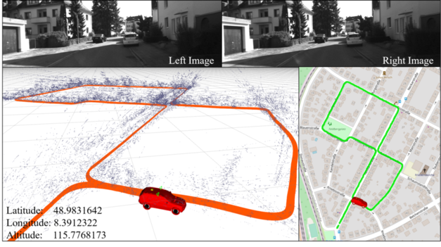
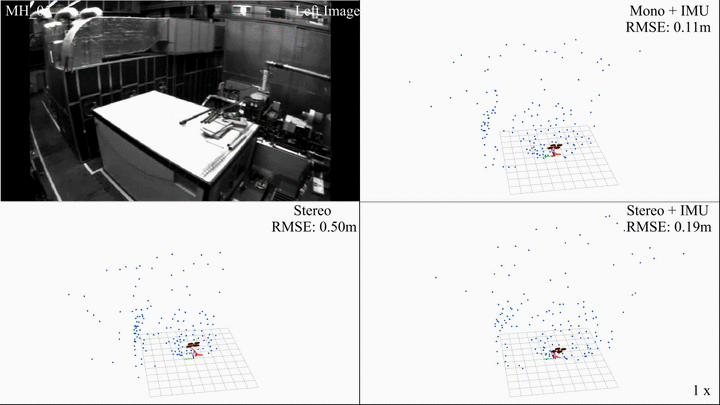

# SSLAM_V2
## An optimization-based stereo camera state estimator

The updated version of sslam replacing g2o with Ceres (g2o gives ocational crashes) and add optical flow as front end for better tracking, which can be accelerated by GPU. We add IMU and GPS as potential sensor fusion.



SSLAM_V2 is an optimization-based multi-sensor (mainly stereo camera) state estimator, which achieves accurate self-localization for autonomous applications.
It supports multiple visual-inertial sensor types (stereo cameras, mono camera + IMU, stereo cameras + IMU). 

**Features:**
- Save & Load functions for familiar scenes with higher accuracy (need GPS initial reference)
- multiple sensors support (stereo cameras / mono camera+IMU / stereo cameras+IMU)
- visual loop closure
- Option to fuse with GPS positions

**Authors:** [Zhang Handuo](http://zhanghanduo.github.io), from the Robot Vision Group, [NTU](https://www.ntu.edu.sg/Pages/home.aspx)

## 1. Prerequisites
### 1.1 **Ubuntu** and **ROS**
Ubuntu 64-bit 16.04.
ROS Kinetic. [ROS Installation](http://wiki.ros.org/ROS/Installation)

### 1.2. **Ceres Solver**
Follow [Ceres Installation](http://ceres-solver.org/installation.html).

### 1.3. **Cereal Serialization**
It is used to serialize / deserialize map points swiftly and lightly.
```
    git clone https://github.com/USCiLab/cereal.git
    cd cereal
```
Edit CMakeLists.txt and change line 4 from `OFF` to `ON`.
```
    mkdir build && cd build
    cmake ..
    make -j8
    sudo make install
```
Note that this library requires C++11, so when building your own package, please pass `-std=c++11` to `g++`.

## 2. Build SSLAM_REUSE
Clone the repository and catkin_make:
```
    cd ~/catkin_ws/src
    git clone https://gitlab.com/handuo/sslam_resuse.git
    cd ../
    catkin_make (or catkin build)
```

## 3. EuRoC Example
Download [EuRoC MAV Dataset](http://projects.asl.ethz.ch/datasets/doku.php?id=kmavvisualinertialdatasets) to YOUR_DATASET_FOLDER. Take MH_01 for example, you can run VINS-Fusion with three sensor types (monocular camera + IMU, stereo cameras + IMU and stereo cameras). 
Open four terminals, run sslam_estimator odometry, visual loop closure(optional), rviz and play the bag file respectively. 
Green path is VIO odometry; yellow path is odometry under visual loop closure.

### 3.1 Monocualr camera + IMU

```
    roslaunch sslam_estimator bus_imu.launch
    rosbag play YOUR_DATASET_FOLDER/bus_03_with_imu.bag
```

### 3.2 Stereo cameras + IMU

```
    roslaunch sslam_estimator bus_imu.launch
    rosbag play YOUR_DATASET_FOLDER/bus_03_with_imu.bag
```

### 3.3 Stereo cameras

```
    roslaunch sslam_estimator bus.launch
    rosbag play YOUR_DATASET_FOLDER/bus_01.bag
```


## 4. KITTI Example
### 4.1 KITTI Odometry (Stereo)
Download [KITTI Odometry dataset](http://www.cvlibs.net/datasets/kitti/eval_odometry.php) to YOUR_DATASET_FOLDER. Take sequences 00 for example,
Open two terminals, run sslam_estimator and rviz respectively. 
```
    rosrun sslam_estimator kitti_odom_test ~/catkin_ws/src/sslam_resuse/slam_estimator/config/kitti_odom/kitti_config00-02.yaml YOUR_DATASET_FOLDER/sequences/00/ 
```
### 4.2 KITTI GPS Fusion (Stereo + GPS)
Download [KITTI raw dataset](http://www.cvlibs.net/datasets/kitti/raw_data.php) to YOUR_DATASET_FOLDER. Take [2011_10_03_drive_0027_synced](https://s3.eu-central-1.amazonaws.com/avg-kitti/raw_data/2011_10_03_drive_0027/2011_10_03_drive_0027_sync.zip) for example.
Open three terminals, run sslam_estimator, global fusion and rviz respectively. 
Green path is VIO odometry; blue path is odometry under GPS global fusion.
```
    roslaunch sslam_estimator bus_global.launch
```

## 5. SSLAM2 on car demonstration
Run sslam odometry, visual loop closure(optional), rviz and play the bag file respectively. 
Green path is VIO odometry; red path is odometry under visual loop closure.
```
    roslaunch sslam_estimator car.launch
    rosbag play YOUR_DATASET_FOLDER/car.bag
```

