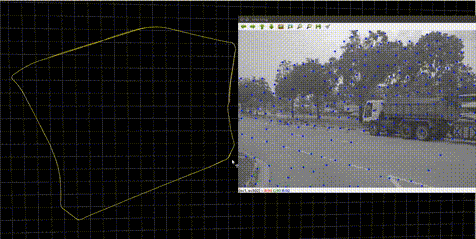
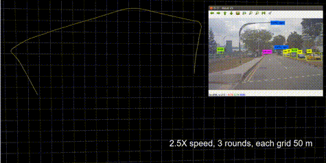

.. _chapter-overview:

Overview
========

SSLAM package is an optimization-based multi-sensor (mainly stereo camera) state estimator,
which achieves accurate self-localization for autonomous applications.

It supports multiple visual-inertial sensor types (stereo cameras, mono camera + IMU, stereo cameras + IMU).

It contains three modules:

#. Camera models (camodocal) for camera modeling;

#. SLAM Estimator (slam_estimator) for real-time localization;

#. Pose Graph (pose_graph) for re-localization, loop closure and map loading & saving.

The updated version of SSLAM replacing g2o with Ceres (g2o gives occasional crashes) and add optical flow
as front end for better tracking, which can be accelerated by GPU. We add IMU and GPS as potential sensor fusion.

Features
--------

    - Save & Load functions for familiar scenes with higher accuracy need GPS initial reference).

    - Multiple sensors support (stereo cameras / mono camera + IMU / stereo cameras + IMU).

    - Visual loop closure.

    - Options to fuse with GPS and INS data.

    - Able to handle heavy dynamic issue with the assist of `cubicle detect <https://gitlab.com/ugv_stereo/cubicle_detect.git>`_ repository.

SLAM Performance without dynamic ability.

SLAM Performance with dynamic ability.

Author
------

 `Zhang Handuo <http://zhanghanduo.github.io>`_, from the Robot Vision Group, NTU.

Thanks to `VINS-Mono <https://github.com/HKUST-Aerial-Robotics/VINS-Mono.git>`_  and  `OrbSLAM <https://github.com/raulmur/ORB_SLAM2.git>`_  for the inspirations.

.. figure:: ../../image/demo.gif
   :figwidth: 650px
   :height: 260px
   :align: center
