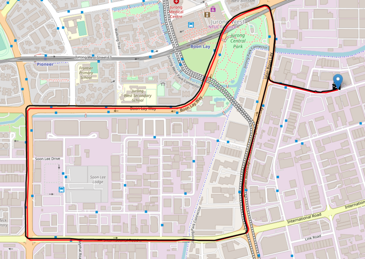

.. SSLAM documentation master file, created by
   sphinx-quickstart on Fri Aug  2 15:02:01 2019.
   You can adapt this file completely to your liking, but it should at least
   contain the root `toctree` directive.

SSLAM Overview
==============

SSLAM package is an optimization-based multi-sensor (mainly **stereo camera**) state estimator,
which achieves accurate self-localization and map management for autonomous applications.

|pic1|   |pic2|

.. |pic2| image:: ../../image/demo.gif
   :width: 63%

SSLAM Package Contents
======================

.. toctree::
   :maxdepth: 2

   Overview

   Installation
   UserGuide
   Front-end
   Back-end
   Map-management

.. toctree::
   :caption: API REFERENCE
   :maxdepth: 2

   api/class_view_hierarchy
   api/file_view_hierarchy
   api/unabridged_api

